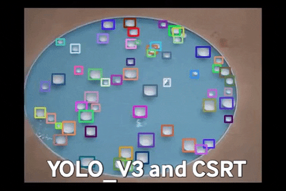

# Graphically Visualizing a Complex System with the Integration of Deep Learning Object Detection and Tracking

### Abstract

The objective of this research is to develop a method for enhancing human visual perception of complex systems and interactions. Specifically, for our Computer Graphics class term project, we are analyzing a [video recording of the “Variation” exhibit](https://www.youtube.com/watch?v=mpwBbm22_y0) by Celeste Boursier-Mougenot in Brazil’s Pinacoteca de Sao Paulo museum. The exhibit consists of three pools containing various-sized, floating ceramic bowls which are set in motion by the pools’ jets. The motion and collisions of the bowls produce complex visual and harmonic patterns. Our research has focused on combining deep learning object detection and tracking techniques to follow the paths of the bowls over time and then apply colored graphical overlays which visualize their motion. The number of bowls, their homogeneity within the system, and the changing camera perspectives throughout the video make this task difficult. Our approach is to apply object re-detection phases which feed into intermediate object tracking sequences. Re-detection phases offer the opportunity to detect bowls which enter and remove bowls which have exited the scene over the course of a tracking sequence. The integration of detection data into the tracking algorithm functions by comparing objects between the final frame of a tracking sequence and those found by the detection algorithm applied to the same frame.

### Object Detection and Tracking

Using a custom trained YOLO_V3 detector, we are able to identify the bowls visible in the video.

Our prototype demonstrates how the YOLO_V3 object detection applied to the first frame can be used to initialized CSRT trackers for the bowls in the scene. Thereafter, the prototype relies on the tracker algorithm to locate bowl's positions. 

